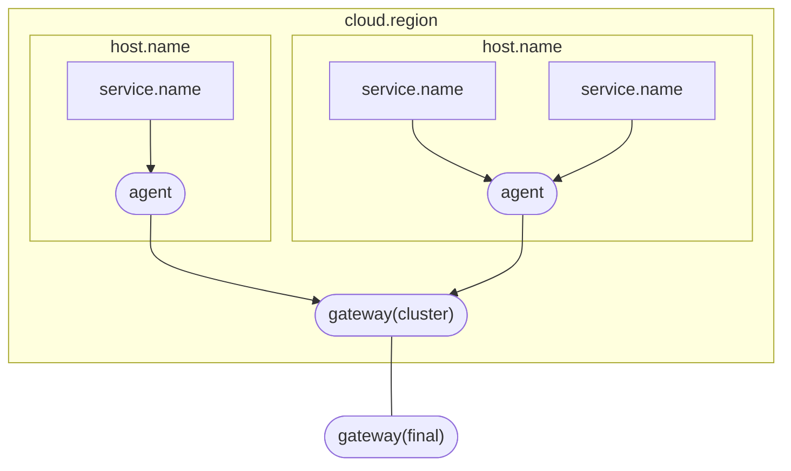

# ZJUSCT 可观测性系统

[可观测性 - ZJUSCT OpenDocs](https://zjusct.pages.zjusct.io/ops/opendocs/operation/observability/)

本仓库是 ZJUSCT 可观测性系统的配置文件。

## Todo

- [ ] Elastic Exporter
- [ ] InfluxDB Exporter
- [ ] Nginx Native Collector
- [ ] Grafana Provision DataSources
- [ ] Grafana Provision Dashboards
- [ ] Grafana Provision Alerts
- [ ] Wait for Prometheus 3.0, [native support for OpenTelemetry](https://prometheus.io/blog/2024/03/14/commitment-to-opentelemetry/) is coming.
- [ ] Wait for [journald - Consider parsing more known fields from logs · Issue #7298 · open-telemetry/opentelemetry-collector-contrib](https://github.com/open-telemetry/opentelemetry-collector-contrib/issues/7298).

## 技术选型

We ❤️ Open Source

| 层次 | 组件 |
| --- | --- |
| 数据采集 | [OpenTelemetry Collector](https://github.com/open-telemetry/opentelemetry-collector) |
| 数据存储 | [ClickHouse](https://github.com/ClickHouse/ClickHouse)、[Elasticsearch](https://github.com/elastic/elasticsearch)、[InfluxDB](https://github.com/influxdata/influxdb)、[Prometheus](https://github.com/prometheus/prometheus) |
| 数据分析、可视化和告警 | [Grafana](https://github.com/grafana/grafana) |

## 数据状态

为了方便运维管理，系统的状态应由仓库中的配置文件完全决定，Docker 是无状态的。需要持久化的数据使用 Docker Volume 存储在本地。

- 配置文件：能够使用 Git 管理的配置文件，通常是简单的文本，存储在本仓库中。依靠这些配置文件，我们只需要克隆仓库并 `docker compose up` 就能够快速部署整个系统，开箱即用。

    部分服务将配置保存到数据库中，比如 Grafana，它使用内置的 SQLite 3 存储配置、用户、仪表盘等数据。即使如此，它也提供了 [Provisioning](https://grafana.com/docs/grafana/latest/administration/provisioning/) 功能，可以通过配置文件初始化各项配置。InfluxDB 更加极端，其自动生成 token 的机制导致配置文件无法完全决定状态。

- 数据库：服务的数据库需要持久化存储，Docker 官方建议使用 Volume 来存储数据库这类写入密集型的数据。

    > Use volumes for write-heavy workloads: Volumes provide the best and most predictable performance for write-heavy workloads. This is because they bypass the storage driver and do not incur any of the potential overheads introduced by thin provisioning and copy-on-write. Volumes have other benefits, such as allowing you to share data among containers and persisting even when no running container is using them.

    为了做到开箱即用，`compose.yml` 中的 Volume 均使用相对路径，Git 仓库保留 `database` 的空文件夹结构。

## 安全

区分四种访问范围：

| 区域 | 信任度 | 暴露的服务 |
| --- | --- | --- |
| Docker 内部、宿主机 | 受 Docker Engine 管理的通信，完全信任 | 所有 |
| 集群内部 | 安全状态良好，无需 TLS 加密 | 部分无认证和弱认证的服务，如 syslog、snmp |
| 校内网络 | 需要 TLS 加密，需要认证 | 仅 otel-collector 和 Grafana |
| 公网 | 阻断 | 无 |

认证 Token 托管在集群 VaultWarden 中。在 `compose.yml` 中设置为环境变量，通过 `get_credential.sh` 脚本生成 `.env` 文件，由 Docker Compose 读取。`.env` 文件不应当提交到 Git 仓库中。

## 细节

### OpenTelemetry

Collector 部署为 **Agent + Gateway 模式**。在这种模式下，agent 尽可能只负责采集数据，更多的转换和处理逻辑交给 gateway。

**资源属性（Resource Attributes）**用于表示产生数据的实体，由不同层级的 Collector 附加。下面是基于

- Semantic Conventions 1.28.0
- OTel 1.38.0
- OTel Collector Contrib v0.111.0
- 日期：2024-10-14

在 ZJUSCT 可观测性系统中的资源属性及其来源：

- 节点 agent：服务和容器至少具有一项，节点必须有。
    - [进程和运行时 `process.*`](https://opentelemetry.io/docs/specs/semconv/resource/process/)：不强制要求。
    - [服务 `service.*`](https://opentelemetry.io/docs/specs/semconv/resource/#service)：
        - `journaldreceiver` **使用 Operator 提取** `SYSLOG_IDENTIFIER` 字段。
        - `filelogreceiver` **使用 Operator 添加**。一般情况下手动添加（文件内很少再包含服务名）。
    - [容器 `container.*`](https://opentelemetry.io/docs/specs/semconv/resource/container/)：
        - `dockerstatsreceiver` **自动添加**。
        - `filelogreceiver` **使用 Operator 提取** Docker JSON 日志中的字段，需要修改 Docker `deamon.json`。
            > 修改 `daemon.json` 后，需要重建 docker 容器，日志选项才会生效。[linux - Docker daemon.json logging config not effective - Stack Overflow](https://stackoverflow.com/questions/46304780/docker-daemon-json-logging-config-not-effective)
    - [节点 `host.*`](https://opentelemetry.io/docs/specs/semconv/resource/host/) 和[系统 `os.*`](https://opentelemetry.io/docs/specs/semconv/resource/os/)：
        - `resourcedetector` 在流水线中**自动添加**。
- 集群 gateway：
    - [集群 `cloud.*`](https://opentelemetry.io/docs/specs/semconv/resource/cloud/)：
        - `cloud.region`：在流水线中**手动添加**。
        > 目前 OTel 并未规定真正意义上的“集群”资源属性，因此暂借云服务信息 `cloud.*` 代替。
    > 在简单跨集群部署的情况下可能没有单独的集群 gateway，此时需要 agent 中添加 `cloud.region`。

除了上述资源属性和基本的 JSON 等格式解析，agent 尽可能不进行其他处理。这样既方便部署（更改主要发生在 gateway），也能够保持 agent 的轻量化，减少边缘侧资源消耗。
